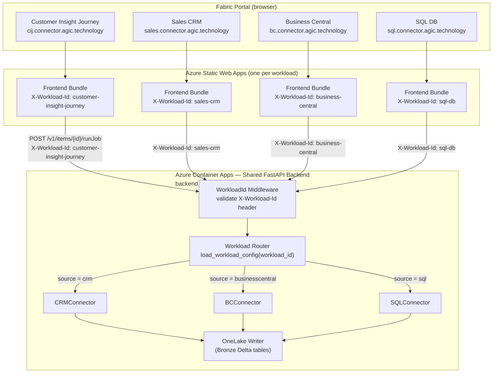
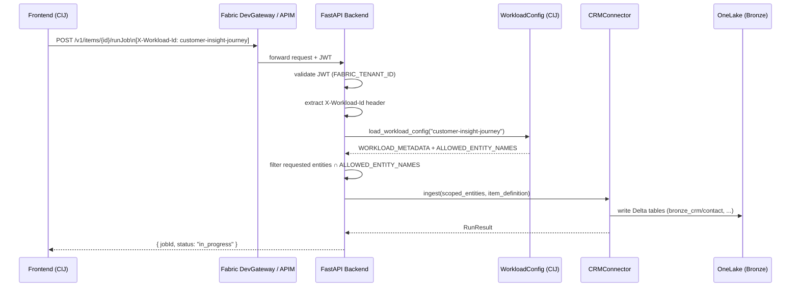

# Multi-Workload Routing Architecture

> Describes how a single FastAPI backend routes requests from four separate frontend workloads using the `X-Workload-Id` HTTP header.

---

## Request Flow



---

## Header Injection (Frontend)

Every workload frontend sets the `X-Workload-Id` header via the shared API client:

```typescript
// shared/utils/apiClient.ts
export function createWorkloadFetch(workloadId: WorkloadId) {
  return (url: string, init?: RequestInit) =>
    fetch(url, {
      ...init,
      headers: {
        ...init?.headers,
        "X-Workload-Id": workloadId,
      },
    });
}
```

The `workloadId` value is sourced from each workload's static config:

```typescript
// workloads/customer-insight-journey/frontend/config/workloadConfig.ts
export const WORKLOAD_CONFIG = {
  workloadId: "customer-insight-journey" as const,
  // ...
};
```

---

## Header Validation (Backend Middleware)

```python
# backend/app/api/workloads.py
class WorkloadId(str, Enum):
    CUSTOMER_INSIGHT_JOURNEY = "customer-insight-journey"
    SALES_CRM                = "sales-crm"
    BUSINESS_CENTRAL         = "business-central"
    SQL_DB                   = "sql-db"

def get_workload_id(request: Request) -> WorkloadId:
    wid = request.headers.get("X-Workload-Id")
    if not wid or wid not in WorkloadId._value2member_map_:
        raise HTTPException(400, detail="Missing or invalid X-Workload-Id header")
    return WorkloadId(wid)
```

Requests without a valid header are rejected with `HTTP 400` on all endpoints except `/health`.

---

## Workload Config Scoping (Backend)

Each workload has a config module that restricts which entities are allowed:

```python
# backend/app/workload_config/customer_insight_journey.py
WORKLOAD_METADATA = {
    "id":           "customer-insight-journey",
    "display_name": "Customer Insight Journey",
    "source":       "crm",
    "entities": [
        {"id": "contact",             "display_name": "Contact",              "table": "bronze_crm/contact"},
        {"id": "msdynmkt_journey",    "display_name": "Customer Journey",     "table": "bronze_crm/msdynmkt_journey"},
        {"id": "msdynmkt_email",      "display_name": "Marketing Email",      "table": "bronze_crm/msdynmkt_email"},
    ],
}
ALLOWED_ENTITY_NAMES = frozenset(e["id"] for e in WORKLOAD_METADATA["entities"])
```

The `jobs.py` endpoint uses `ALLOWED_ENTITY_NAMES` to filter the entity list from the item definition before passing it to the connector, so a malicious or misconfigured frontend can never trigger ingestion of out-of-scope entities.

---

## Sequence Diagram — runJob



---

## Entity Scoping per Workload

| Workload | Source | Entities |
|---|---|---|
| `customer-insight-journey` | CRM | `contact`, `msdynmkt_journey`, `msdynmkt_email` |
| `sales-crm` | CRM | `lead`, `opportunity`, `account`, `quote`, `salesorder` |
| `business-central` | BC | `customers`, `vendors`, `items`, `salesorders`, `purchaseorders`, `generalledgerentries` |
| `sql-db` | SQL | User-defined (permissive — all table names allowed) |

---

*2026-05-21 UTC*
